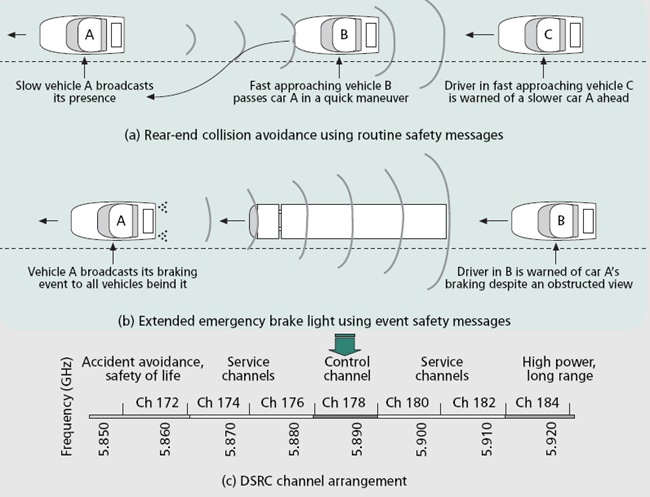

# 802.11.p Applications 

+ Emergency warning system for vehicles 
+ Cooperative Adaptive Cruise Control 
+ Cooperative Forward Collision Warning 
+ Intersection collision avoidance 
+ Approaching emergency vehicle warning (Blue Waves) 
+ Vehicle safety inspection 
+ Transit or emergency vehicle signal priority 
+ Electronic parking payments 
+ Commercial vehicle clearance and safety inspections 
+ In-vehicle signing 
+ Rollover warning 
+ Probe data collection 
+ Highway-rail intersection warning

# 802.11.p Operation 

+ Spectrum is divided into 7 bands
    - channel 178 is for control (sfety)
    - 2 edge channel are reserved for future
    - The rest are service channels (not application specific)
+ IEEE 802.11.a adjusted for low overhead operations

# Available Testbed

+ [Cohda Wireless](http://cohdawireless.com/Portals/0/PDFs/CohdaWirelessMK4a.pdf)
